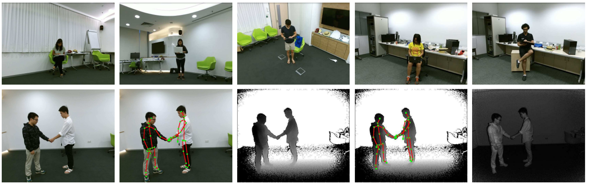
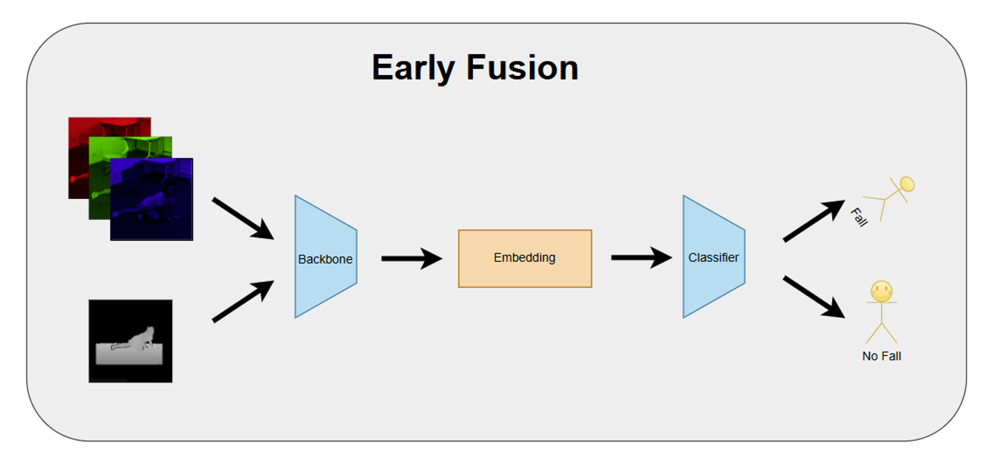
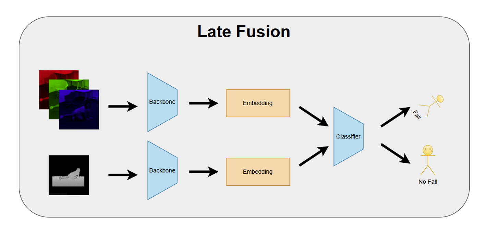
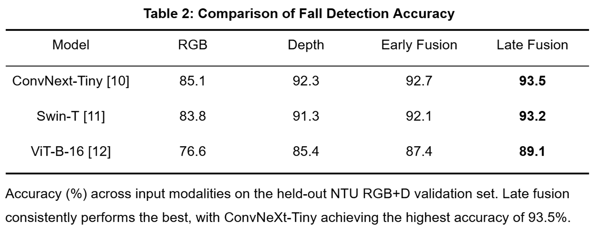

# Fall Detection

Exploration of modality fusion for fall detection.

# Dataset

This project uses the NTU RGB+D Dataset, an action recognition dataset which includes RGB, Depth, and IR imagery. The data was collected from 40 subjects across a number of different rooms and camera angles. There are 56,000 videos for a total of 5 million frames. A visualization of the different environments, camera angles, environments, and modalities is shown below.



# Experiments

We first define a performance baseline by training models on pure RGB & Depth modalities. We then explore the performance of different fusion strategies, including early fusion and late fusion. For early fusion, the RGB and Depth image are concatenated along the channel dimension before passing through the backbone. For late fusion, modality-specific models are trained, and then a follow-on classifier is trained on the features extracted from the frozen backbones.





To evaluate how results generalize across model architectures, we select models from a number of popular model families, including CNNs (ConvNeXt), Vision Transformers (ViT), and hybrid models (Swin Transformer). The best validation accuracy of each model and modality is shown in the table below.



# Setup

The steps to prepare the environment and download the [NTU RGB+D](https://rose1.ntu.edu.sg/dataset/actionRecognition/) are outlined below.

1. Create the environment:
```bash
conda env create -f environment.yaml
```

2. Activate the environment:
```bash
conda activate fall-detection
```

3. Download the dataset from [NTU RGB+D](https://rose1.ntu.edu.sg/dataset/actionRecognition/). Scripts to download each modality are provided in `scripts/`. Once downloaded, extract the modalities to their respective folders (i.e. `rgb`, `depth`, `ir`).

> Note: The dataset is large, downloading it takes a long time.

4. Preprocess the dataset:
```bash
python preprocess_ntu.py
```

> Note: Preprocessing takes a long time, you might want to run the script in a `tmux` or `screen` session.

# Training

1. Create a configuration file or modify an existing configuration in `configs`. Make sure to update `dataset.root` with the path to your preprocessed dataset.

2. Start training:
```bash
python train.py
```